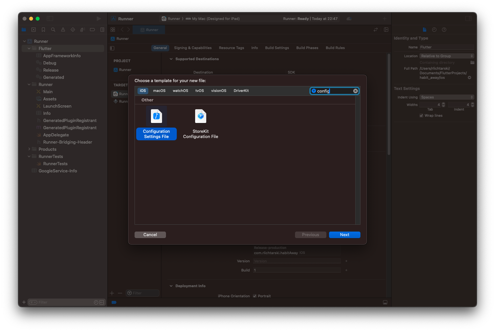
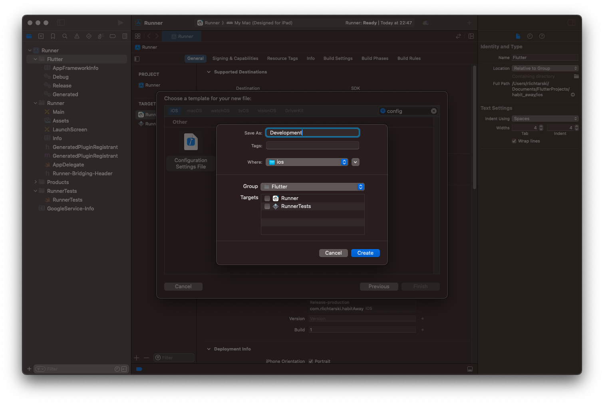
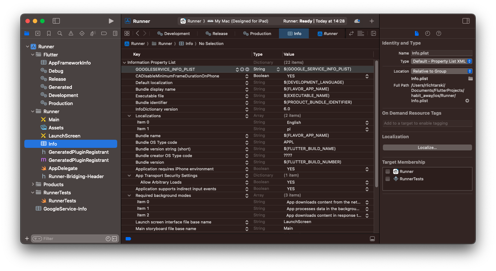
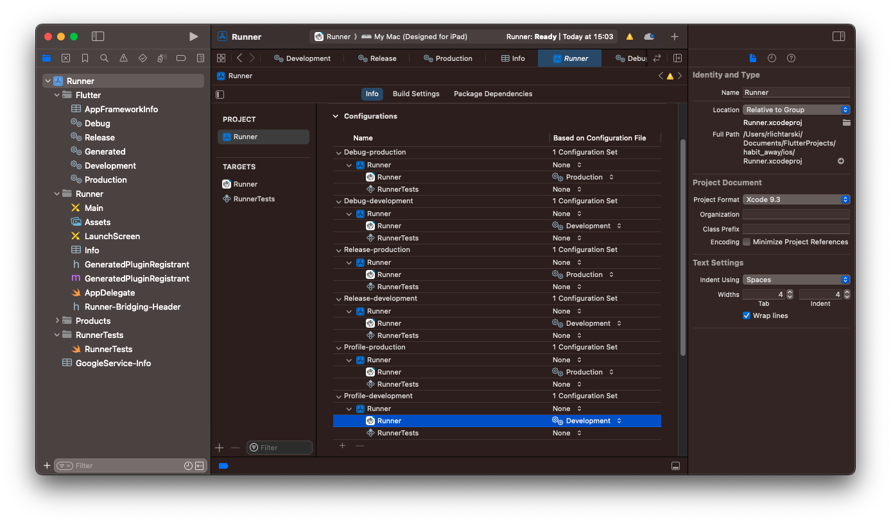
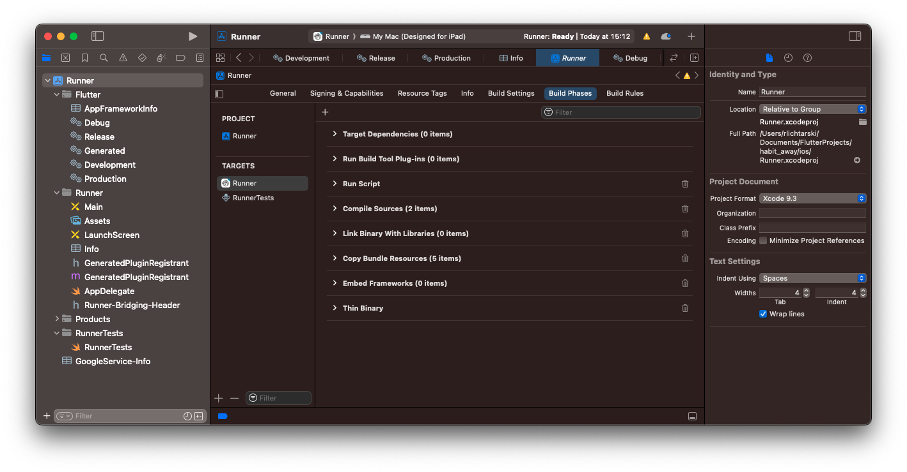
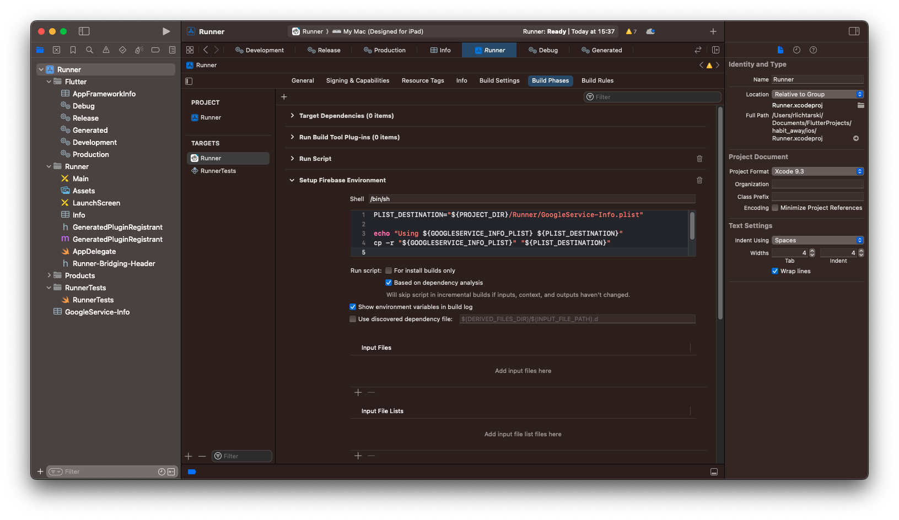

# Firebase configuration with creating development environments

1. Add [`firebase_core`](https://pub.dev/packages/firebase_core) dependency into your main `pubspec.yaml` file.
2. Make sure that you have Node.js installed.
3. Install the Firebase CLI if you don't have it. Use the following command: `npm install -g firebase-tools`.
4. Log into Firebase using your Google account with this command: `firebase login`
5. Install the FlutterFire CLI by running this command: `dart pub global activate flutterfire_cli`. 
6. In your Firebase console, create two projects - one for development environment and second for production environment. You can call them e.g. `habits-away-dev` and `habits-away-prod`.
7. After those project were created - enable Authentication in the `Authentication` tab and inside `Sign-in method` enable `Email/Password` provider and `Google` provider.
8. In the `ios/Runner` folder, create a `Firebase` folder and create `dev` and `prod` folders inside of it.
9. Now, configure the Firebase project for development in the mobile app. Run the following command:
```sh
flutterfire config \
  --project=habit-away-dev \
  --out=lib/firebase_options_dev.dart \
  --ios-bundle-id=com.example.habitAway.dev \
  --android-app-id=com.example.habit_away.dev
```
> [!CAUTION]
> Make sure that you use the correct iOS Bundle ID and Android App ID. You can easily check it in Xcode by opening the project build settings. On Android, check the `applicationId` along with `applicationIdSuffix` for each flavor in `android/app/build.gradle` file.
10. Move the generated `GoogleService-Info.plist` file in the `ios` folder into `ios/Runner/Firebase/dev` folder.
11. Move the generated `google-services.json` file in the `android/app` folder into `android/app/src/development` folder.
12. Now, configure the Firebase project for production in the mobile app. Run the following command:
```sh
flutterfire config \
  --project=habit-away-prod \
  --out=lib/firebase_options_prod.dart \
  --ios-bundle-id=com.example.habitAway \
  --android-app-id=com.example.habit_away
```
13. Move the generated `GoogleService-Info.plist` file in the `ios` folder into `ios/Runner/Firebase/prod` folder.
14. Leave the generated `google-services.json` file in the `android/app` folder as it is.
15. Copy `GoogleService-Info.plist` file from `ios/Runner/Firebase/dev` folder into the root of the `ios/Runner` folder so that Firebase services can find this.

---

16. Now, here's the part of how to set up multiple Firebase configurations for development and production environment in Xcode. Check these steps to make sure that you have Firebase environments set up correctly.
17. In Xcode, open the `ios/Runner.xcodeproj` file from the project.
18. Right click on the Flutter folder and click *New File*. Filter with `config` and select `Configuration Settings File`


19. Save this file as `Development`. Do that again and create a `Production` file.


20. Open the `Development` file and paste the following content:
```sh
#include? "Pods/Target Support Files/Pods-Runner/Pods-Runner.debug.xcconfig"
#include "Flutter/Generated.xcconfig"

GOOGLESERVICE_INFO_PLIST = ${PROJECT_DIR}/Runner/Firebase/dev/GoogleService-Info.plist

GOOGLE_INFO_URL = <paste here the REVERSED_CLIENT_ID key from the GoogleService-Info.plist file>
```
21. Open the `Production` file and paste the following content:
```sh
#include? "Pods/Target Support Files/Pods-Runner/Pods-Runner.release.xcconfig"
#include "Flutter/Generated.xcconfig"

GOOGLESERVICE_INFO_PLIST = ${PROJECT_DIR}/Runner/Firebase/prod/GoogleService-Info.plist

GOOGLE_INFO_URL = <paste here the REVERSED_CLIENT_ID key from the GoogleService-Info.plist file>
```
This setup ensures that depending on the selected configuration (dev or prod), Xcode will know to choose the right GoogleService-Info.plist file. The `GOOGLE_INFO_URL` is essential for Google sign in to work.

22. Go into `Info` file and add a new property called `GOOGLESERVICE_INFO_PLIST` with a value `$(GOOGLE_SERVICE_INFO_PLIST)`.

This is how the Info.plist file is dynamically updated to use the correct plist file path based on the configuration.

23. Go to `Runner` from the left panel and in `Project` also choose `Runner` and scroll to the section `Configurations`. Now, for each configuration, replace the `Debug` and `Release` with corresponding Environments (e.g. `Debug-production` - set `Production` instead of `Debug`)


24. Now create a build phase. Click `Runner` under `Targets` and click `Build Phases`. Click the `+` button and select "New Run Script Phase". 


25. Rename the "Run Script" with "Setup Firebase Environment". Inside, add the following script:
```sh
PLIST_DESTINATION="${PROJECT_DIR}/Runner/GoogleService-Info.plist"

echo "Using ${GOOGLESERVICE_INFO_PLIST} ${PLIST_DESTINATION}"
cp -r "${GOOGLESERVICE_INFO_PLIST}" "${PLIST_DESTINATION}"
```

This script copies the content of the correct `GoogleService-Info.plist` file into the location where Firebase services can find it (in the root of Runner).
> [!CAUTION]
> Make sure that you place the "Setup Firebase Environment" script between *Run Script* and *Compile Sources*. The position of this script is important because the `GoogleService-Info.plist` file needs to be present before the compilation step. If the script is run too late, e.g. after Compile Sources, then the app won't find the correct `GoogleService-Info.plist` file during the build process.


##### Reference:
This [Medium Article](https://demmss.medium.com/creating-development-environments-for-firebase-using-the-very-good-flutterfire-clis-in-flutter-250eba52bd4d) shows step by step how to configure the Firebase environments for both Android and iOS.