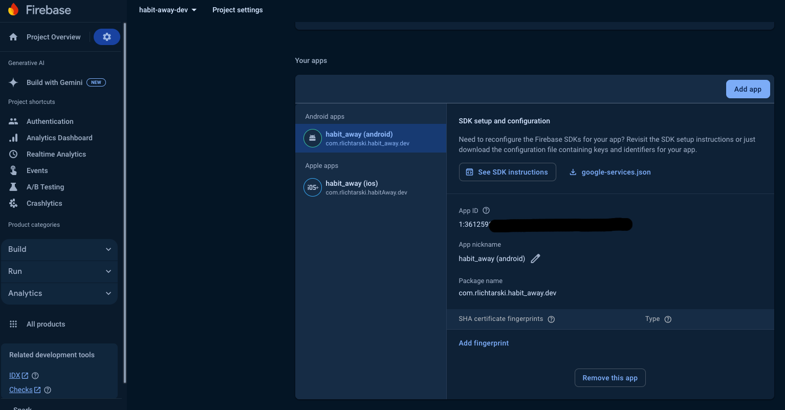
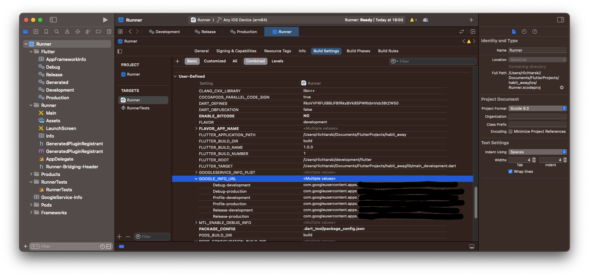

# Google Sign-In configuration with Firebase

Every Android app must be signed with a certificate before it can be installed on a device. The keystore is used to sign the app and allowing it to be verified by Google.

---

1. Generate a new keystore file. To generate it, use the following command:

for macOS/Linux users:
```sh
keytool -genkey -v -keystore ~/AppsKeystore/habit-away-upload-keystore.jks -keyalg RSA -keysize 2048 -validity 10000 -alias upload
```

for Windows users:
```sh
keytool -genkey -v -keystore %userprofile%\Apps\Keystore\habit-away-upload-keystore.jks -storetype JKS -keyalg RSA -keysize 2048 -validity 10000 -alias upload
```

This command stores the upload-keystore.jks file in your home directory. If you want to store it elsewhere, change the argument you pass to the -keystore parameter.
Remember the password you provided for the keystore.
Keep the keystore file private. Do not publish it anywhere.

2. In our project, create a `key.properties` file inside `/android` folder. Add these keys to this file:
```sh
storePassword=<password-from-previous-step>
keyPassword=<password-from-previous-step>
keyAlias=upload
storeFile=<keystore-file-location>
```

3. If you haven't used `very_good_cli` to create your app, then configure keystore inside the `/android/app/build.gradle` file [referencing to documentation](https://docs.flutter.dev/deployment/android#configure-signing-in-gradle). Creating an app with `very_good_cli` configures it by default.

4. Use the following command to generate an SHA1 key for the debug mode:
```sh
keytool -list -v -keystore ~/.android/debug.keystore -alias androiddebugkey -storepass android -keypass android
```

Copy the value of SHA1.

5. Go to the Firebase Console for each project and then go into "Project settings" -> "Your apps" and select the Android app.

Click "Add fingerprint" and paste the copied SHA1 key.

6. Use the following command to generate an SHA1 key for the release mode:
```sh
keytool -list -v -keystore <keystore-file-location> -alias upload
```
When CLI asks you to for the keystore password, provide the one you typed while generating the keystore.

After that, copy the value of SHA1.

7. Repeat step 5.

8. Inside the `ios/Runner/Info.plist` file, add the following code:
```xml
<key>CFBundleURLSchemes</key>
<array>
    <string>$(GOOGLE_INFO_URL)</string>
</array>
```

9. 
a. Inside Xcode, select `Runner` and again click `Runner` from `Targets`. Select `Build settings` and scroll down to `User-Defined`. Make sure that for the `GOOGLE_INFO_URL` you have the correct <REVERSED_CLIENT_ID> (from the `GoogleService-Info.plist` file) provided for each environment. 


b. Alternatively, you can go to `ios/Runner.xcodeproj/project.pbxproj` file, search for the `/* Begin XCBuildConfiguration section */` section and for EACH configuration which contains `baseConfigurationReference` with the comment of the environment (e.g. `/* Production.xcconfig */` [not the one which starts with `Pods-RunnerTests`]), inside the `buildSettings`, add the `GOOGLE_INFO_URL` property with the correct <REVERSED_CLIENT_ID> from the`GoogleService-Info.plist` file.
Example:
```sh
<build number> /* Debug-production */ = {
    isa = XCBuildConfiguration;
    baseConfigurationReference = <baseConfigurationReference> /* Production.xcconfig */;
    buildSettings = {
        ...
        GOOGLE_INFO_URL = <REVERSED_CLIENT_ID from production GoogleService-Info.plist file>;
        ...
    };
    name = "Debug-production";
};
```

10. Inside `packages/env` create two files: `.env.dev` and `.env.prod`. Inside of them, add the `IOS_CLIENT_ID` property and for the value, provide `CLIENT_ID` from the corresponding `GoogleService-Info.plist` file. Run `dart run build_runner clean` and `dart run build_runner build`

#### References:
[Build and release an Android app](https://docs.flutter.dev/deployment/android#sign-the-app)
[Set up multiple Firebase environments in Flutter](https://kmtsandeepanie.medium.com/set-up-multiple-firebase-environments-in-flutter-9f88bc284454#662d)
